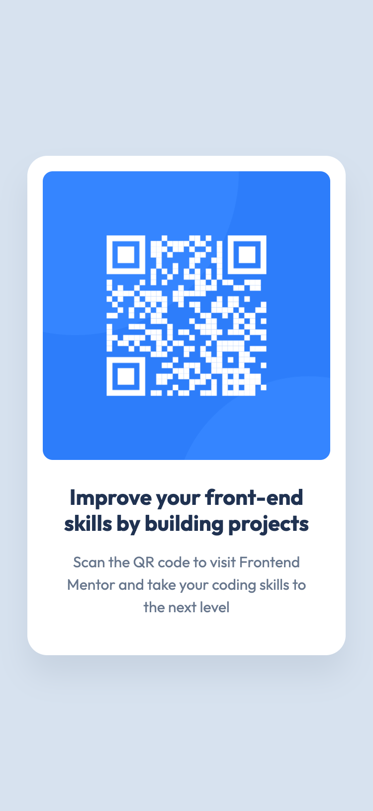
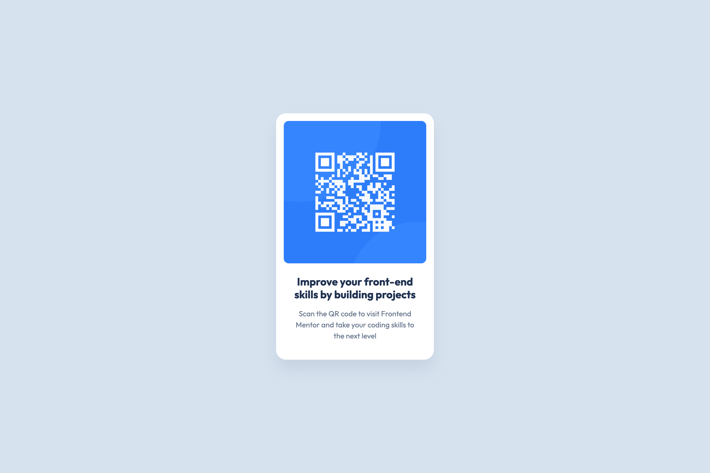

# Frontend Mentor - QR code component solution

This is a solution to the [QR code component challenge on Frontend Mentor](https://www.frontendmentor.io/challenges/qr-code-component-iux_sIO_H). Frontend Mentor challenges help you improve your coding skills by building realistic projects.

## Table of contents

- [Overview](#overview)
  - [Screenshot](#screenshot)
  - [Links](#links)
- [My process](#my-process)
  - [Built with](#built-with)
  - [What I learned](#what-i-learned)
  - [Continued development](#continued-development)
  - [Useful resources](#useful-resources)
- [Author](#author)
- [Acknowledgments](#acknowledgments)

**Note: Delete this note and update the table of contents based on what sections you keep.**

## Overview

### Screenshot

- Mobile view
  
- Desktop view
  

### Links

- Solution URL: [Add solution URL here](https://your-solution-url.com)
- Live Site URL: [Frontend Mentor | QR code component](https://your-live-site-url.com](https://vangmanawkairung.github.io/Frontend-Mentor_qr-code-component/)

## My process

### Built with

- <b>HTML Structure</b>: Provides a clean and semantic layout for better content organization.
- <b>Meta Tags</b>: Enhances SEO and ensures proper display on various devices.
- <b>Google Fonts</b>: Improves typography and visual appeal with custom fonts.
- <b>CSS Custom Properties</b>: Simplifies color and value management for consistent theming.
- <b>Mobile-First Workflow</b>: Optimizes the design for mobile devices first, ensuring responsiveness.
- <b>[Bootstrap](https://getbootstrap.com)</b> - CSS library: Streamlines layout and styling, reducing the need for custom CSS.
- <b>SCSS</b>: Enhances CSS organization and readability through variables and nesting.
- <b>Responsive Design</b>: Ensures the website looks good and functions well across all screen sizes.

### What I learned

- <b>HTML Structure</b>: I’ve been creating clean and semantic HTML using tags like `<article>`, `<section>`, and headers.
- <b>Meta Tags</b>: I’re using meta tags like viewport and description to improve device compatibility and SEO.
- <b>Google Fonts</b>: I’ve successfully integrated Google Fonts for enhanced typography.
- <b>CSS Custom Properties</b>: SCSS variables help I manage colors and values efficiently for a consistent theme.
- <b>Mobile-First Workflow</b>: The layout starts mobile-friendly and adapts well to larger screens.
- <b>Bootstrap</b>: I effectively used Bootstrap to streamline layout and styling.
- <b>SCSS</b>: SCSS helps organize my code with features like nesting and variables.

### Continued development

- <b>Dynamic Themes</b>: Use CSS variables to create light/dark themes.
- <b>Responsive Refinements</b>: Enhance responsiveness with more media queries.
- <b>JavaScript</b>: Add interactivity, like theme switching or dynamic features.
- <b>Advanced Projects</b>: Tackle more complex projects like responsive forms or API-driven apps.

### Useful resources

- [Bootstrap Document](https://getbootstrap.com/docs/4.0/getting-started/introduction/) - Provides a comprehensive guide to effectively using the framework for building responsive and customizable web applications with pre-built components and best practices.

## Author

- Frontend Mentor - [@VangmanawKairung](https://www.frontendmentor.io/profile/VangmanawKairung)
- GitHub - [VangmanawKairung](https://github.com/VangmanawKairung)

## Acknowledgments

I would like to express my heartfelt gratitude to Frontend Mentor for providing inspiring challenges that enhance my coding skills, and to Bootstrap for offering a powerful framework that simplifies web development. Special thanks to VS Code for being an exceptional code editor, and to ChatGPT for providing valuable assistance and insights throughout my learning journey. I also appreciate the Preview feature on Mac for its convenience in testing designs, along with all the other tools that have supported my growth as a developer. Your contributions have been instrumental in my progress!
